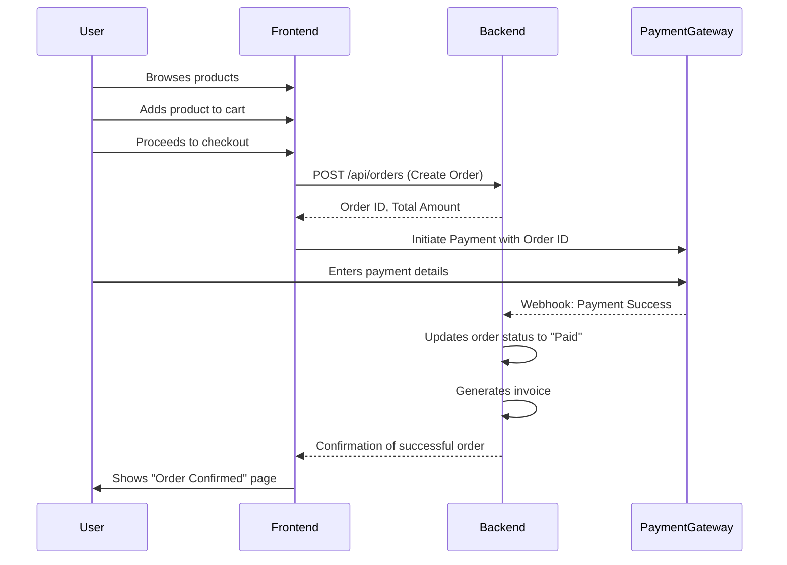
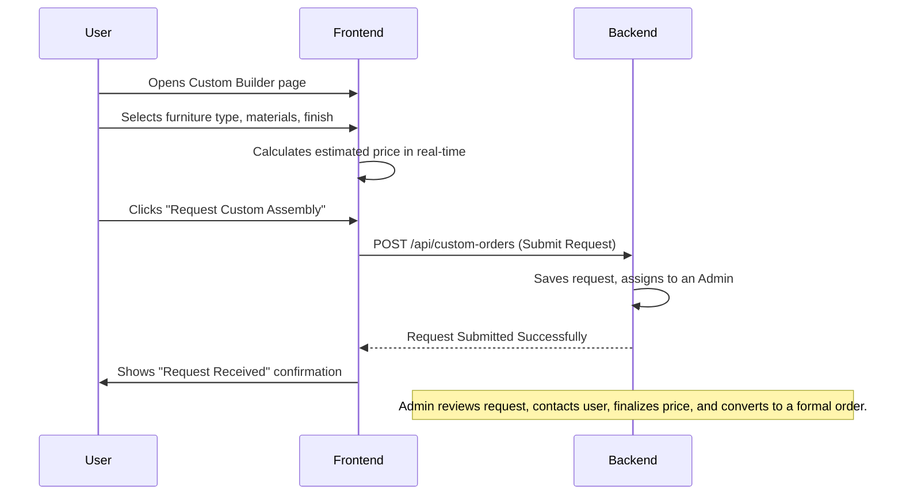
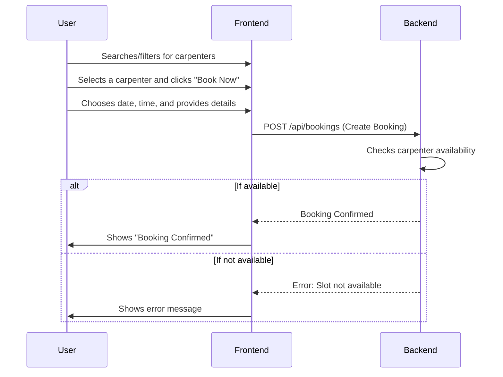

# Comprehensive Project Overview: Vishwakarma 3D Showroom

## 1. Introduction

This document provides a comprehensive overview of the **Vishwakarma 3D Showroom** application. It outlines the business objectives, system architecture, user roles, and the overall business and data flow of the platform.

### 1.1. Business Objectives

- **Primary Goal**: To create a modern, feature-rich e-commerce platform for high-quality, customizable furniture, blending traditional craftsmanship with modern technology.
- **Key Offerings**:
  - Sell ready-made, high-quality furniture.
  - Offer a custom furniture builder for personalized orders.
  - Provide a marketplace to connect customers with skilled carpenters.
  - Inspire users with an AI-powered Style Quiz and personalized recommendations.
- **Target Audience**: Homeowners, interior designers, and individuals seeking both standard and bespoke furniture solutions.

---

## 2. System Architecture

The application is designed with a decoupled, microservices-friendly architecture. The frontend (Next.js) is the primary user interface, which will communicate with a backend (Java Spring Boot) via a REST API.

```mermaid
graph TD
    subgraph "Client-Side"
        UserDevice[User's Device (Browser)]
    end

    subgraph "Frontend (Vercel)"
        NextJS[Next.js Application]
    end

    subgraph "Backend (To be built with Java Spring Boot)"
        JavaAPI[Java Spring Boot REST API]
        Database[(PostgreSQL/MySQL Database)]
        PaymentGateway[Payment Gateway (e.g., Stripe, Razorpay)]
    end

    subgraph "Third-Party Services"
        Firebase[Firebase (for Genkit AI features)]
        CloudStorage[Cloud Storage (S3/Cloudinary for Images)]
    end

    UserDevice --> NextJS;
    NextJS --> JavaAPI;
    NextJS --> Firebase;
    JavaAPI --> Database;
    JavaAPI --> PaymentGateway;
    JavaAPI --> CloudStorage;
    JavaAPI --> Firebase;

    style NextJS fill:#000,stroke:#fff,stroke-width:2px,color:#fff
    style JavaAPI fill:#6db33f,stroke:#fff,stroke-width:2px,color:#fff
    style Firebase fill:#FFCA28,stroke:#fff,stroke-width:2px,color:#000
```

### Components:

- **Frontend**: A Next.js application hosted on Vercel. It is responsible for rendering the UI, managing user sessions on the client side, and making API calls. It also integrates directly with Firebase Genkit for AI-powered features.
- **Backend**: A Java Spring Boot application that will serve as the system's core. It will handle business logic, data persistence, user authentication, and payment processing.
- **Database**: A relational database (like PostgreSQL or MySQL) to store all application data, including users, products, orders, and carpenters.
- **Firebase Genkit**: Used for specialized AI features like the Style Quiz and furniture recommendations. The frontend can call these serverless functions directly.
- **Payment Gateway**: An external service to handle secure payment processing.
- **Cloud Storage**: A dedicated service (like AWS S3 or Cloudinary) to store and serve large static assets like product images and 3D models.

---

## 3. User Roles and Permissions

The system will support three main user roles:

| Role        | Description                                                                                              | Key Permissions                                                                                                                                                              |
|-------------|----------------------------------------------------------------------------------------------------------|------------------------------------------------------------------------------------------------------------------------------------------------------------------------------|
| **Customer**  | A general user of the website who can browse products, make purchases, and book carpenters.                | - View products and carpenters.<br/>- Take the Style Quiz.<br/>- Place orders for ready-made or custom furniture.<br/>- Book carpenters.<br/>- Manage their own profile and orders. |
| **Carpenter** | A skilled professional listed on the marketplace.                                                          | - Manage their public profile (specialties, experience, rates).<br/>- View and manage their bookings.<br/>- Communicate with customers who have booked them.                       |
| **Admin**     | A privileged user responsible for managing the platform's content, users, and operations.                  | - Add, update, and delete products and categories.<br/>- Manage all user accounts (customers, carpenters, other admins).<br/>- Approve/reject new carpenter registrations.<br/>- View all orders and platform analytics. |

---

## 4. Business Flow

The core business flows are centered around purchasing furniture and hiring carpenters.

### 4.1. Furniture Purchase Flow



### 4.2. Custom Furniture Builder Flow



### 4.3. Carpenter Booking Flow


